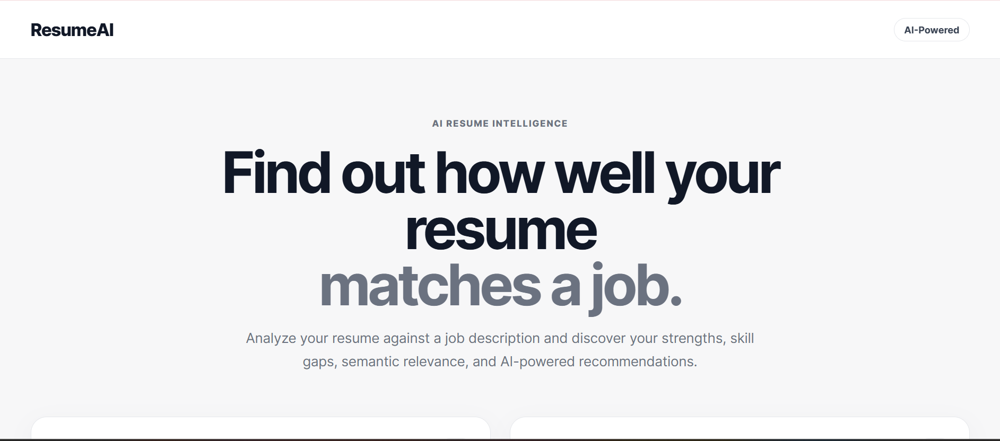
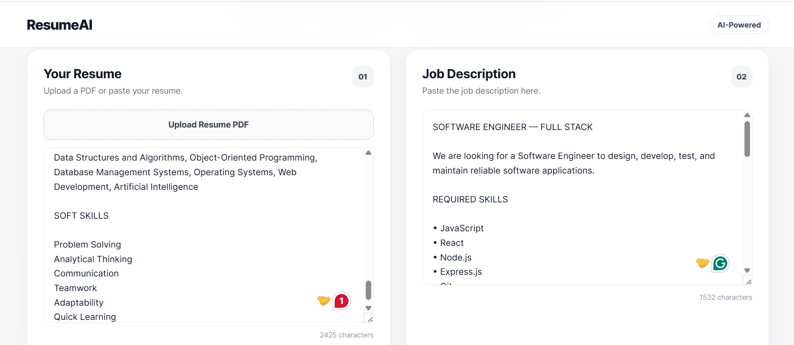
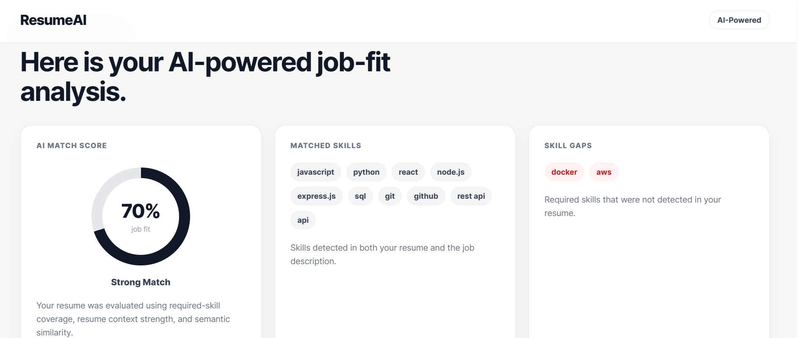
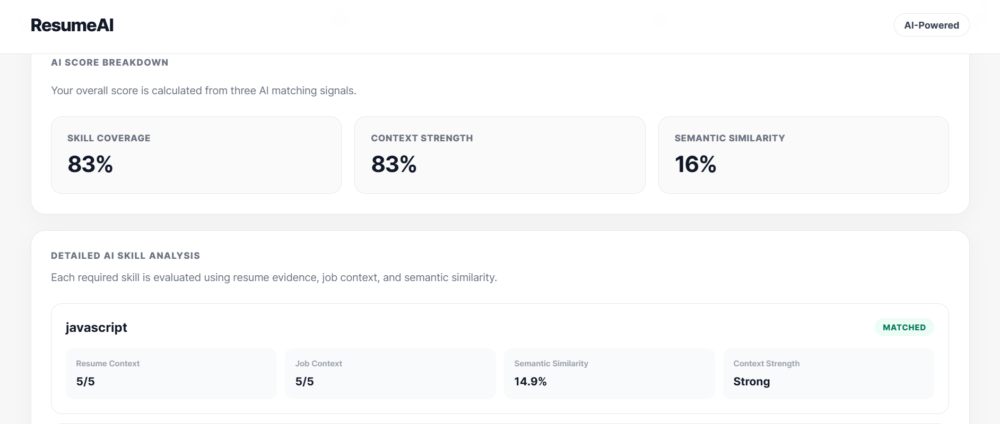

# ResumeAI: An Intelligent NLP-Based Resume–Job Matching and Career Recommendation System

ResumeAI is an AI-powered resume intelligence system that analyzes resumes against job descriptions using skill matching, context-aware analysis, and semantic similarity.

The system identifies matched skills, detects skill gaps, calculates an intelligent job-match score, and generates personalized recommendations to improve resume–job alignment.

## Key Features

- PDF resume upload and automated text extraction
- NLP-based resume and job-description analysis
- Skill matching and skill-gap detection
- Context-aware skill analysis
- Semantic similarity analysis
- Weighted AI job-match scoring
- Personalized career recommendations
- React-based frontend
- Node.js and Express.js backend
- REST API integration
- Git and GitHub version control
- Responsive and user-friendly interface

## How It Works

1. Upload a resume in PDF format or paste the resume text.
2. Paste the target job description.
3. ResumeAI extracts and analyzes the relevant skills.
4. The system compares resume skills with job requirements.
5. Context strength and semantic similarity are evaluated.
6. A weighted job-match score is calculated.
7. Matched skills and skill gaps are displayed.
8. Personalized recommendations are generated.

## Match Score

ResumeAI calculates the final match score using three major factors:

- **60% — Required Skill Coverage**
- **20% — Resume Context Strength**
- **20% — Semantic/NLP Similarity**

This provides a more meaningful evaluation than simple keyword matching.

## Technology Stack

### Frontend

- React
- JavaScript
- HTML
- CSS
- Vite

### Backend

- Node.js
- Express.js
- REST APIs
- PDF text extraction
- NLP-based skill analysis

### Tools

- Git
- GitHub
- Visual Studio Code

## Project Structure

```text
ResumeAI/
├── backend/
│   ├── server.js
│   ├── package.json
│   └── ...
│
├── frontend/
│   ├── src/
│   │   ├── App.jsx
│   │   ├── App.css
│   │   ├── index.css
│   │   └── main.jsx
│   ├── package.json
│   └── ...
│
├── screenshots/
│   ├── resumeai-home.png
│   ├── resumeai-upload.png
│   ├── resumeai-analysis.png
│   └── resumeai-results.png
│
├── .gitignore
└── README.md


## Screenshots

### ResumeAI Interface



### Resume Upload



### Job Match Analysis



### Analysis Results

